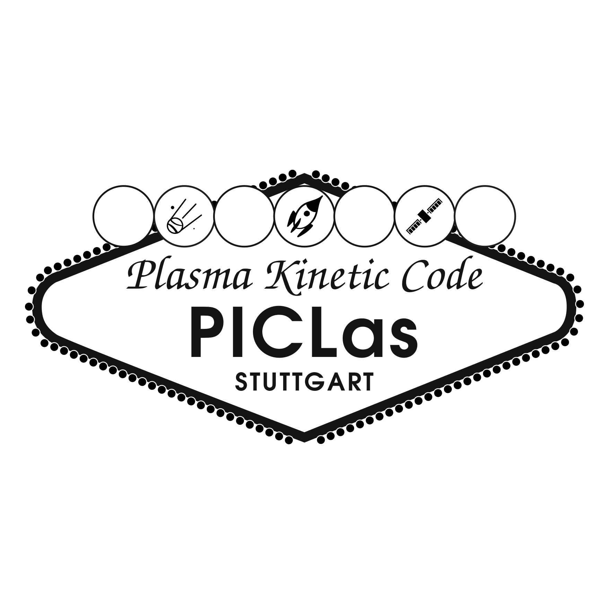
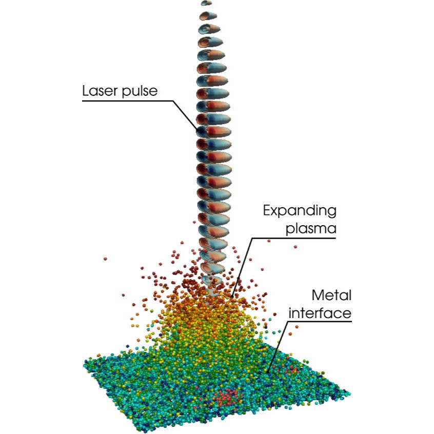
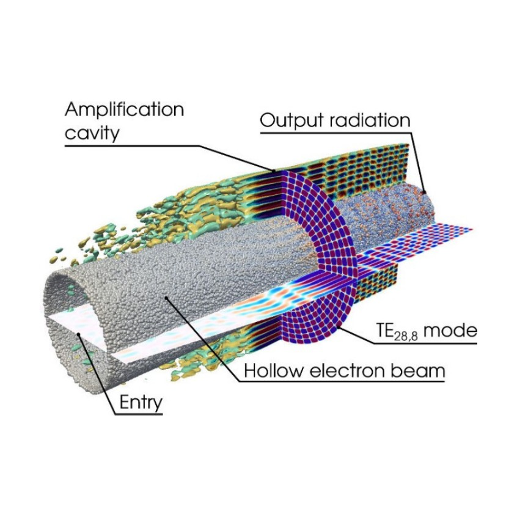
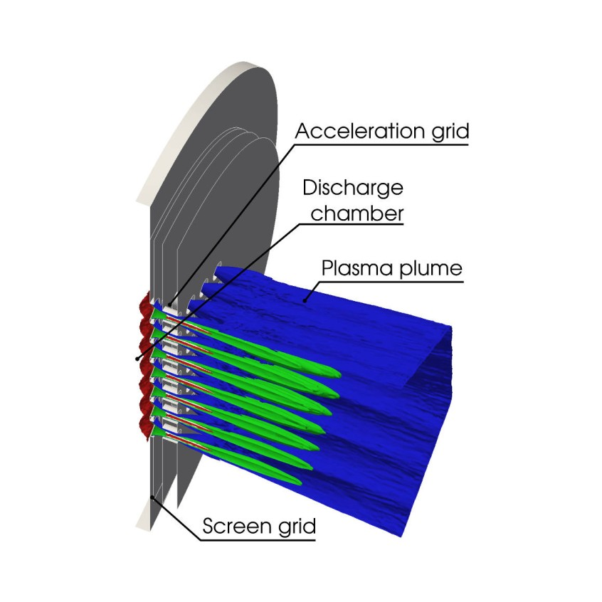
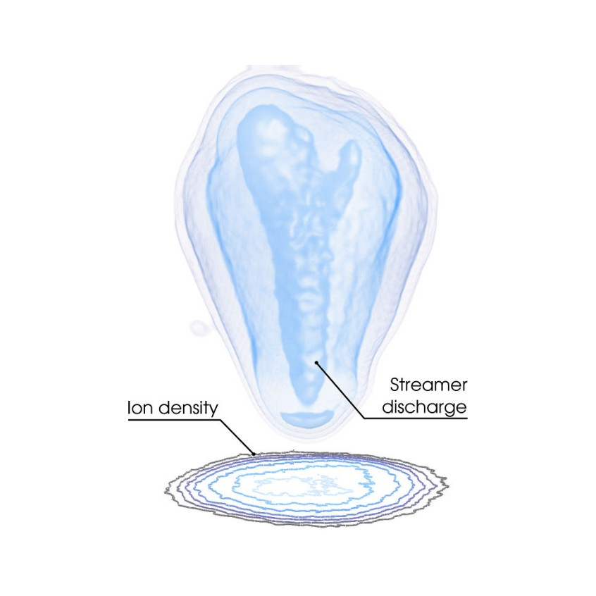
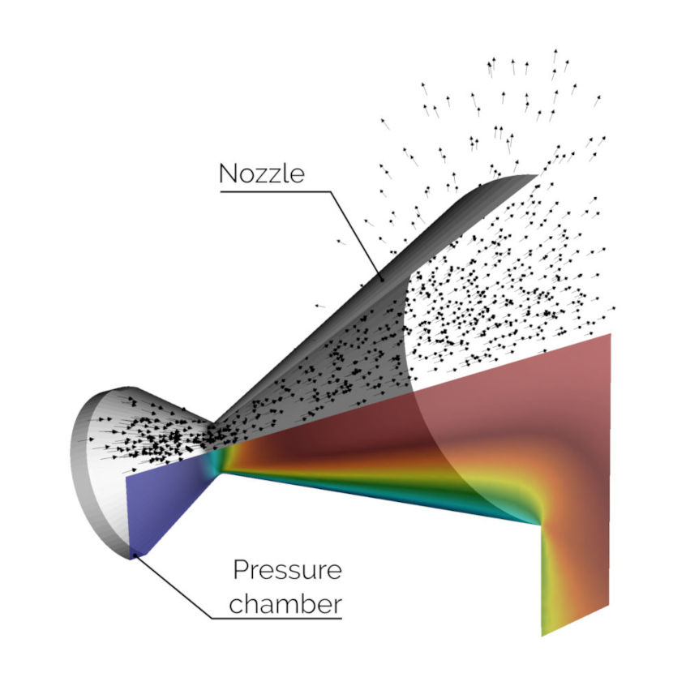
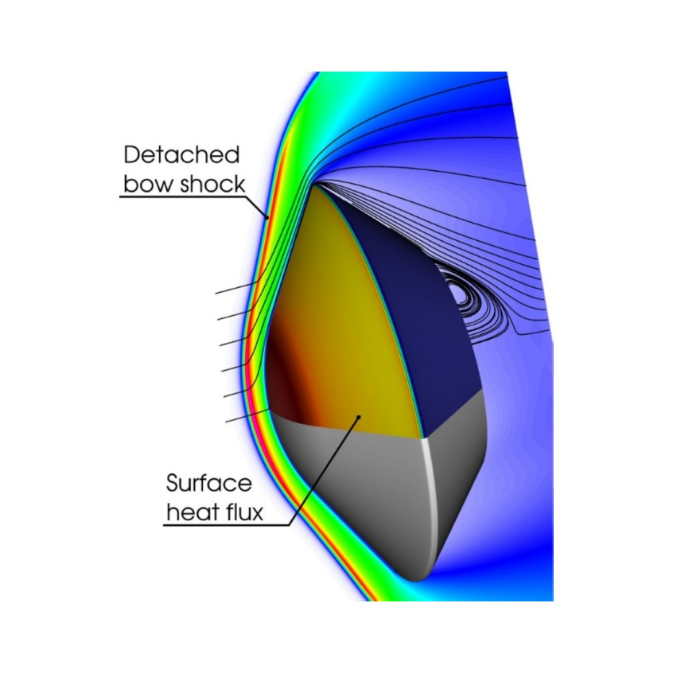
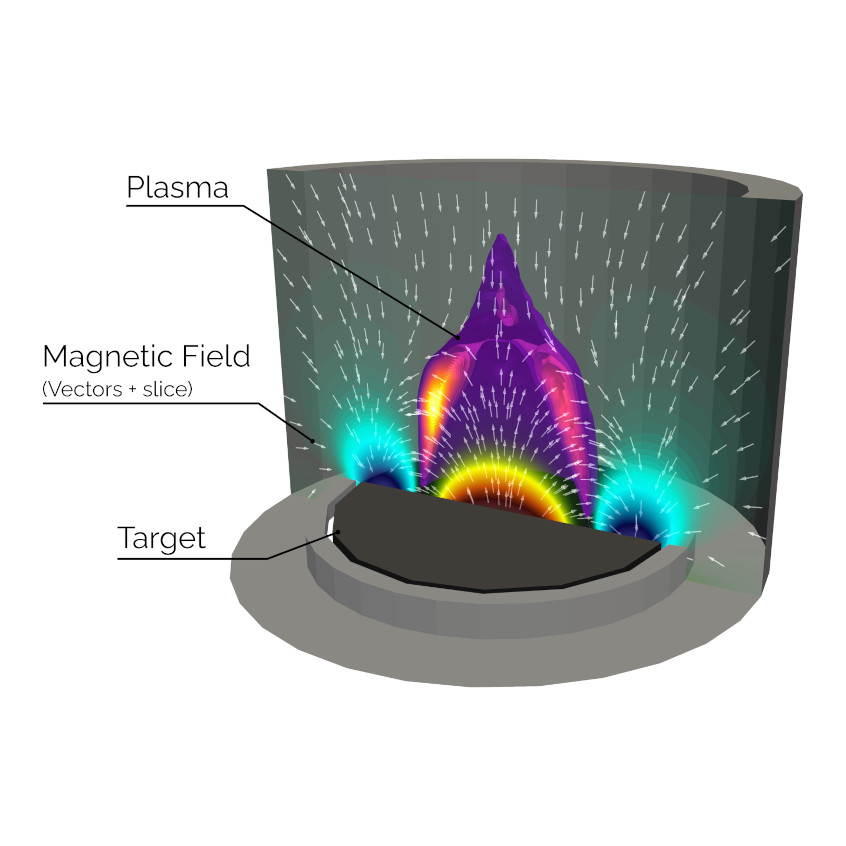
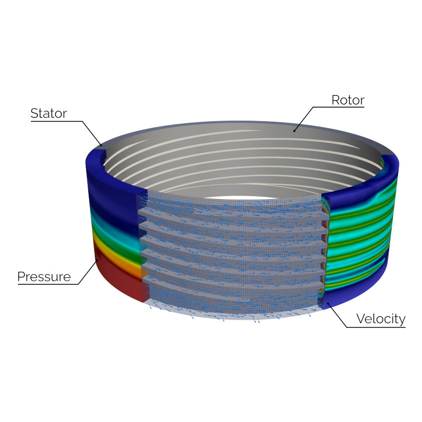

# Welcome to PICLas

PICLas is a parallel, three-dimensional particle-based kinetic simulation framework combining the Particle-in-Cell (PIC), Direct Simulation Monte Carlo (DSMC), BGK, and Fokker-Planck methods for the simulation of plasma dynamics and rarefied gas flows.

The code is developed cooperatively by the [Institute of Space Systems (IRS)](https://www.irs.uni-stuttgart.de/en/research/space-transport-technology/numerical-modeling-and-simulations/) and the spin-off company [boltzplatz](https://boltzplatz.eu/).
PICLas is designed to be a flexible, modular particle simulation suite, supporting unstructured meshes, MPI parallelism, and dynamic load balancing for high-performance computing environments.

<table align="center">
  <tr>
    <td width="33%"></td>
    <td width="33%"></td>
    <td width="33%"></td>
  </tr>
  <tr>
    <td></td>
    <td></td>
    <td></td>
  </tr>
  <tr>
    <td></td>
    <td></td>
    <!-- <td></td> -->
  </tr>
</table>

## Features
- **Particle-in-Cell (PIC)** solver for self-consistent electromagnetic and electrostatic plasma simulations
- **Direct Simulation Monte Carlo (DSMC)** for rarefied, non-equilibrium gas flows
- **Coupled PIC-DSMC** for reactive plasma flow simulation
- **BGK** and **Fokker-Planck** collision operators as computationally efficient alternatives to DSMC in near-continuum regimes
- Support for **unstructured, high-order meshes**
- **MPI parallelization** with dynamic load balancing for large-scale HPC simulations
- **Variable particle weighting** (including radial/cell-local weighting for 2D/axisymmetric cases)
- **Surface interaction models**: data-driven scattering, surface chemistry, and charging

## Documentation and Installation
Full documentation, including the installation procedure, is available in the PICLas [User Guide](https://piclas.readthedocs.io/).
Installation instructions specifically can be found in [Chapter 2](https://piclas.readthedocs.io/en/latest/userguide/installation.html).

Pre-compiled executables (that only require pre-installed MPI for parallel execution) for Linux can directly be downloaded as
AppImage containers from the [PICLas release tag assets](https://github.com/piclas-framework/piclas/releases).

### Building from source

PICLas is built using CMake. A typical build looks like:
```bash
git clone https://github.com/piclas-framework/piclas.git
cd piclas
mkdir build && cd build
cmake ..
make -j
```
See the User Guide for detailed configuration options, compiler requirements, and dependency setup.

### Dependencies

PICLas uses several external libraries as well as auxiliary functions from open source projects, including:

* [PyHOPE (High Order Preprocessor)](https://github.com/hopr-framework/PyHOPE)
* [cmake](https://www.cmake.org)
* [LAPACK](http://www.netlib.org/lapack/)
* [MPI](https://www.open-mpi.org/)
* [HDF5](https://www.hdfgroup.org/)
* [PETSc](https://petsc.org/)

## Tutorials

A set of tutorials covering common use cases (PIC, DSMC, and coupled simulations) is included in the [`tutorials`](tutorials) directory and documented in the [User Guide: Tutorials](https://piclas.readthedocs.io/en/latest/userguide/tutorials/index.html).

## Regression Testing

An overview of the regression tests used for continuous integration is given in [REGGIE.md](REGGIE.md).

## Citing PICLas

PICLas is a scientific project.
If you use PICLas for publications or presentations in science, please support the project by citing following paper and the repository.
In addition, if you use specific methods, please also cite the corresponding papers shown in [REFERENCES.md](REFERENCES.md)

For general citation cite the repository and the general publication about PICLas:

 - Repository: use GitHub's `Cite this repository` option

 - Paper:
```bibtex
@article{fasoulas_combining_2019,
    author = "Fasoulas, S. and Munz, C.-D. and Pfeiffer, M. and Beyer, J. and Binder, T. and Copplestone, S. and Mirza, A. and Nizenkov, P. and Ortwein, P. and Reschke, W.",
    title = "Combining particle-in-cell and direct simulation Monte Carlo for the simulation of reactive plasma flows",
    journal = "Physics of Fluids",
    volume = "31",
    number = "7",
    pages = "072006-1 -- 072006-19",
    year = "2019",
    month = "07",
    doi = "10.1063/1.5097638",
}
```

## Contributing & Getting Help

We welcome contributions of all kinds - from bug fixes and documentation improvements to new features.
Please see [CONTRIBUTING.md](CONTRIBUTING.md) for guidelines.

You can also reach the team through:

- **Academic:** [Numerical Modelling and Simulation Group, Institute of Space Systems, University of Stuttgart](https://www.irs.uni-stuttgart.de/en/research/space-transport-technology/numerical-modeling-and-simulations/)
- **Simulation services & training:** [boltzplatz - numerical plasma dynamics GmbH](https://boltzplatz.eu)

A list of current contributors is maintained in [CONTRIBUTORS.md](CONTRIBUTORS.md).

## License

The PICLas code is licensed under the [GNU General Public License v3.0](https://www.gnu.org/licenses/gpl-3.0.html).
The license can be found in [LICENSE.md](LICENSE.md) and the list of contributors in [CONTRIBUTORS.md](CONTRIBUTORS.md).